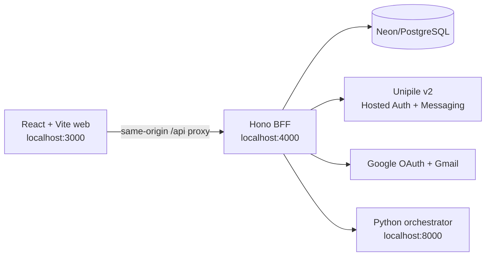

# Plucia

Plucia is a pnpm/Turborepo monorepo for a multi-channel sales workspace. The
React dashboard combines messaging, Gmail, CRM data, and AI-assisted operator
workflows behind a Hono backend-for-frontend (BFF). PostgreSQL/Neon stores
authentication, organization, and normalized messaging data.

## Application architecture



The browser calls only `apps/api`. User and organization identity always comes
from the Better Auth session; the frontend does not send trusted tenant IDs.
In development, Vite proxies `/api` and `/healthz` to the BFF so session cookies
remain same-origin.

## Workspace map

| Workspace                    | Purpose                                              | Local port |
| ---------------------------- | ---------------------------------------------------- | ---------: |
| `apps/web`                   | React 19 + Vite dashboard                            |     `3000` |
| `apps/api`                   | Hono BFF, Better Auth, Gmail, messaging, agent proxy |     `4000` |
| `apps/docs`                  | Next.js documentation app                            |     `3001` |
| `apps/worker/orchestrator`   | FastAPI AI/operator orchestration service            |     `8000` |
| `apps/call`                  | Python calling service                               |     `8001` |
| `apps/heartbeat`             | Python heartbeat service                             |     `8002` |
| `packages/db-sql`            | Drizzle schema, migrations, Neon client              |          — |
| `packages/ui`                | Shared React UI package                              |          — |
| `packages/eslint-config`     | Shared ESLint configuration                          |          — |
| `packages/typescript-config` | Shared TypeScript configuration                      |          — |

## Implemented application features

- Better Auth email/password and Google/Apple social authentication.
- Organization-aware sessions and role-based messaging access.
- Gmail mailbox, compose, reply, draft, archive, labels, and attachments.
- Unified messaging accounts for LinkedIn, Sales Navigator, Recruiter,
  WhatsApp, Instagram, and Telegram through Unipile hosted authentication.
- Normalized connected accounts, threads, participants, messages, attachments,
  labels, assignments, read state, jobs, audit events, and webhook inbox/outbox.
- Account connect, reconnect, disconnect, share, synchronize, and start-chat
  operations.
- Server-sent inbox updates with provider webhook ingestion.
- CRM lead/contact views linked to channel identities.
- Operator and agent BFF routes with server-derived user and tenant context.
- Cloudflare Worker-compatible API entry point and Wrangler configuration.
- Responsive dashboard, channel pages, overview metrics, settings, theme support,
  loading/error states, and provider-aware account management UI.

## Requirements

- Node.js 18 or newer (Node.js 22+ recommended)
- pnpm `9.0.0`
- A PostgreSQL or Neon database
- A Unipile v2 application and API key for messaging connections
- Google OAuth credentials for Google sign-in and Gmail
- Python 3.11+ plus the orchestrator dependencies for AI/operator features

Install JavaScript dependencies from the repository root:

```sh
corepack enable
pnpm install
```

## Environment setup

Environment and secret files are ignored by Git. Templates remain tracked.

```sh
cp apps/api/.env.example apps/api/.env
cp apps/web/.env.example apps/web/.env.local
cp packages/db-sql/.env.example packages/db-sql/.env
```

For local Node development, `apps/api/src/node-env.ts` loads files in this
order:

1. `apps/api/.env.local`
2. `apps/api/.env`

Values loaded first are preserved. Use `.env.local` for local URL overrides
without rewriting deployment-oriented values in `.env`.

### Required API values

```dotenv
NODE_ENV=development
PORT=4000
DATABASE_URL=postgresql://...
BETTER_AUTH_SECRET=replace-with-at-least-32-random-characters
BETTER_AUTH_URL=http://localhost:4000
FRONTEND_ORIGINS=http://localhost:3000,http://127.0.0.1:3000
COOKIE_CROSS_SITE=false
COOKIE_SECURE=false
ORCHESTRATOR_URL=http://localhost:8000
```

OAuth provider credentials must be supplied as complete pairs:

```dotenv
GOOGLE_CLIENT_ID=
GOOGLE_CLIENT_SECRET=
APPLE_CLIENT_ID=
APPLE_CLIENT_SECRET=
```

### Unipile v2 messaging

Messaging uses Unipile API v2:

```dotenv
UNIPILE_API_KEY=
UNIPILE_BASE_URL=https://api.unipile.com
UNIPILE_API_VERSION=v2
UNIPILE_WEBHOOK_SECRET=
UNIPILE_HOSTED_AUTH_DOMAIN=
MESSAGING_CALLBACK_URL=http://localhost:4000/api/v1/messaging/accounts/connect/callback
```

`UNIPILE_API_KEY` must be an application-scoped key created in the Unipile v2
dashboard. Legacy v1 access tokens and DSN credentials do not authenticate at
`https://api.unipile.com/v2`.

For production, configure a public HTTPS callback URL, register the webhook
endpoint with Unipile, set the webhook signing secret, and add the deployed web
origin to `FRONTEND_ORIGINS`. A custom hosted-auth domain is optional and must
already be verified in the Unipile dashboard before it is configured here.

### Web development values

Keep `VITE_API_URL` empty for the local same-origin proxy:

```dotenv
VITE_API_URL=
VITE_DEV_BACKEND_URL=http://localhost:4000
VITE_DEV_ALLOWED_HOSTS=
VITE_TEST_MODE=false
```

Set `VITE_API_URL` only when the browser must call a separately deployed API
origin.

## Database setup and migrations

The API and migration command use the same environment precedence:

1. `apps/api/.env.local`
2. `apps/api/.env`
3. `packages/db-sql/.env`
4. root `.env`

Apply every pending migration before starting the API:

```sh
pnpm --filter @repo/db-sql db:migrate
```

Generate a migration after changing files under `packages/db-sql/src/schema`:

```sh
pnpm --filter @repo/db-sql db:generate
pnpm --filter @repo/db-sql db:migrate
```

Migration `0003_messaging_unified_inbox.sql` creates the normalized messaging
schema. It is compatible with databases that already have the legacy
`messaging_provider` enum and adds the v2 provider values without deleting
legacy connected-account data.

## Run locally

Start the API and web app in separate terminals:

```sh
pnpm --filter api dev
```

```sh
pnpm --filter web dev
```

Open:

- Web dashboard: <http://localhost:3000>
- API root: <http://localhost:4000>
- API health: <http://localhost:4000/healthz>
- Health through Vite: <http://localhost:3000/healthz>

You can also start every workspace that declares a `dev` script:

```sh
pnpm dev
```

The API and web app do not require the Python orchestrator to boot. CRM/operator
and agent-backed actions return a service-unavailable response until the
orchestrator is running at `ORCHESTRATOR_URL`.

## API route groups

| Route                 | Responsibility                                            |
| --------------------- | --------------------------------------------------------- |
| `/healthz`            | Process health; intentionally does not query the database |
| `/api/auth/*`         | Better Auth handlers and OAuth callbacks                  |
| `/api/v1/auth/*`      | Application session/profile endpoints                     |
| `/api/v1/mail/*`      | Gmail BFF routes                                          |
| `/api/v1/messaging/*` | Connected accounts and messaging operations               |
| `/api/v1/inbox/*`     | Normalized threads, messages, labels, assignments, events |
| `/api/v1/webhooks/*`  | Signed provider webhook ingestion                         |
| `/api/v1/agent/*`     | Authenticated proxy to the orchestrator                   |

## Validation

Run focused checks:

```sh
pnpm --filter @repo/db-sql check-types
pnpm --filter api lint
pnpm --filter api check-types
pnpm --filter api test
pnpm --filter api build
pnpm --filter web lint
pnpm --filter web build
```

Or run monorepo-wide tasks:

```sh
pnpm lint
pnpm check-types
pnpm build
pnpm format:check
```

## Troubleshooting

### Messaging connect returns `500`

Check whether the messaging migration was applied. A PostgreSQL error such as
`relation "messaging_outbox_events" does not exist` means the database schema
is behind the application. Run:

```sh
pnpm --filter @repo/db-sql db:migrate
```

### Messaging connect reports invalid Unipile credentials

The configured API key was rejected by Unipile v2. Create a key in the same v2
application used for connected accounts, update `UNIPILE_API_KEY`, and restart
the API. Do not put provider keys in `apps/web` or any `VITE_*` variable.

### Protected messaging routes return `401`

Sign in through the web app and let the browser send the Better Auth session
cookie through the Vite proxy. Avoid calling protected routes from a separate
origin unless CORS, cookie security, and `FRONTEND_ORIGINS` are configured for
that deployment.

### Agent routes return `503`

Start the Python orchestrator or point `ORCHESTRATOR_URL` at a reachable
deployment. This does not affect auth, Gmail, messaging, or API health.

## Security notes

- Never commit `.env`, `.env.local`, provider API keys, OAuth client secrets,
  database URLs, webhook secrets, browser cookies, or session tokens.
- Unipile and Gmail credentials stay server-side behind `apps/api`.
- Webhook requests are authenticated independently from browser sessions.
- Tenant and user IDs are derived from the server-validated session.
- If a session token is copied into logs or chat, revoke it by signing out and
  signing back in.

More API-specific deployment and environment details are available in
[`apps/api/README.md`](apps/api/README.md).
